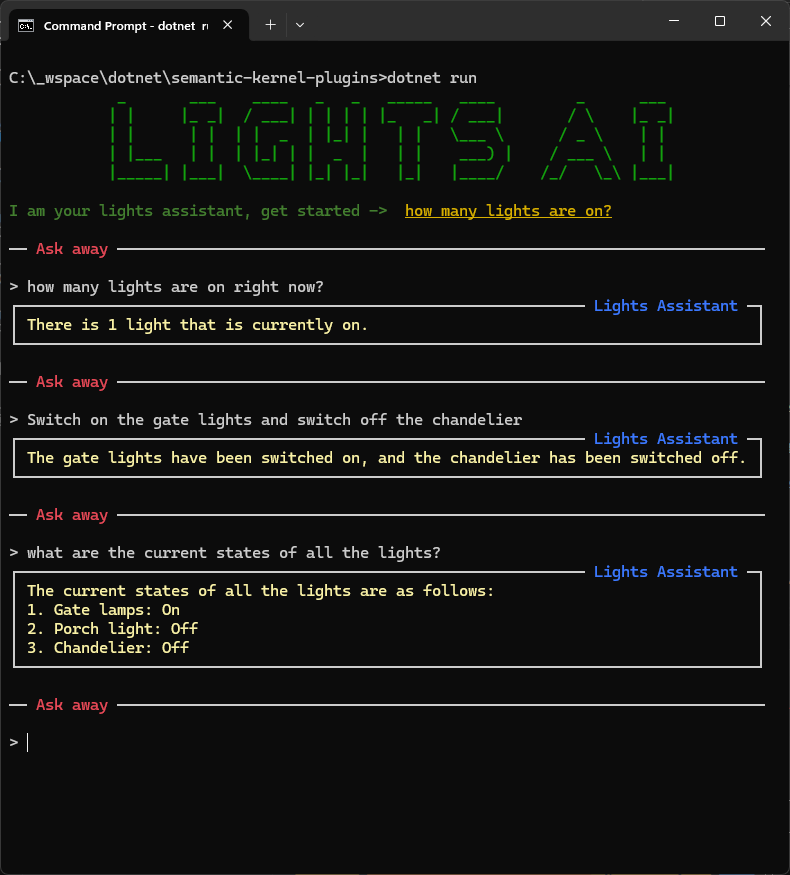

<!-- ABOUT THE PROJECT -->
## About The Project

This is a sample C# project that demonstrates the usage of Microsoft semantics kernel, building custom kernel plugins and allowing LLMs to use the extended plugin functions.

## Dependencies
Run commands

`dotnet add package Microsoft.SemanticKernel`

`dotnet add package Spectre.Console`

## Console interface
Change directory to project root and run command 
`dotnet run`

